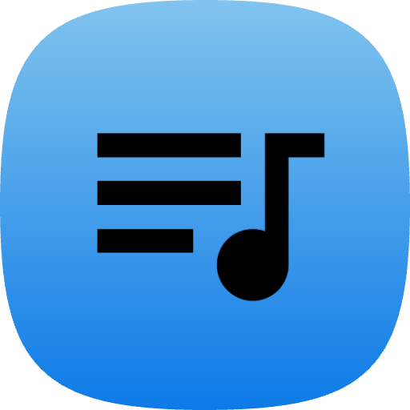

<!-- PROJECT LOGO -->
<br />
<div align="center">
  <a href="https://github.com/sz-balage/DrumBuddy">
    
  </a>
  <h1>DrumBuddy</h1>
  <p align="center">
    A cross-platform app for drummers, allowing them to record, manage, and learn new digital sheets, with real-time feedback.
    <br />
    <strong>Bachelor's Thesis Project by Szabó Balázs</strong>
    <br />
    <br />
    <a href="https://docs.drumbuddy.hu/">Explore the docs »</a>
    <br />
    <a href="https://github.com/baluka1118/DrumBuddy/issues/new?labels=bug&template=bug_report.md">Report Bug</a>
    &middot;
    <a href="https://github.com/baluka1118/DrumBuddy/issues/new?labels=enhancement&template=feature-request.md">Request Feature</a>
  </p>
</div>


---

<!-- TABLE OF CONTENTS -->
<details>
  <summary>Table of Contents</summary>
  <ol>
    <li>
      <a href="#about-the-project">About The Project</a>
      <ul>
        <li><a href="#built-with">Built With</a></li>
      </ul>
    </li>
    <li>
      <a href="#getting-started">Getting Started</a>
      <ul>
        <li><a href="#installation">Installation</a></li>
      </ul>
    </li>
    <li><a href="#usage">Usage</a></li>
    <li><a href="#roadmap">Roadmap</a></li>
    <li><a href="#contact">Contact</a></li>
    <li><a href="#acknowledgments">Acknowledgments</a></li>
  </ol>
</details>


---

## About The Project

**DrumBuddy** is a cross-platform desktop application built for drummers who want to record, analyze, and improve their rhythm.  
It allows users to record their beats onto a **digital sheet**, get **real-time feedback**, and **store their ideas** for future practice or composition.

One of DrumBuddy’s core features is the ability to **compare two sheets**:
- Use one as a _base sheet_ (your intended rhythm)
- Use another as your _played performance_  
→ The app then provides feedback, helping drummers identify mistakes and improve their timing.

It’s designed to work with **any electronic drum kit**, with **customizable MIDI mappings** for flexible compatibility.
> NOTE: The app has limited drumming functionality, as for now it can only record in 4/4 time signature, and the smallest division unit is a 16th note.

> 🎓 This application also serves as my **Bachelor’s thesis project**

---

### Built With

DrumBuddy is 100% C#, leveraging modern cross-platform and reactive technologies:

* [AvaloniaUI](https://avaloniaui.net/) — for building the cross-platform UI  
* [ReactiveUI](https://reactiveui.net/) & [System.Reactive](https://github.com/dotnet/reactive) — for declarative, reactive programming  
* [SQLite](https://www.sqlite.org/) — lightweight embedded database for sheet persistence  
* [ManagedBass](https://github.com/ManagedBass/ManagedBass) — audio & MIDI library for handling drum input, and metronome audio playback  

---

## Getting Started

### Installation
---

#### 🪟 Windows

1. Download the latest **`DrumBuddy-Setup-x.y.z.exe`** from  
   👉 https://github.com/sz-balage/DrumBuddy/releases
2. Run the installer and follow the setup wizard.
3. Launch DrumBuddy from the **Start Menu** or **Desktop shortcut**.

> ⚠️ Windows SmartScreen may display a warning.  
> Click **More info → Run anyway** to continue.

---

#### 🐧 Linux

DrumBuddy is distributed as an **AppImage**, which works on most modern Linux distributions.

1. Download **`DrumBuddy-linux-x64.AppImage`** from  
   👉 https://github.com/sz-balage/DrumBuddy/releases
2. Make the file executable:
   ```bash
   chmod +x DrumBuddy-linux-x64.AppImage
   ```
3. Run the application:
   ```bash
   ./DrumBuddy-linux-x64.AppImage
   ```

You can also integrate the AppImage into your desktop environment using your file manager.

---

#### 🍎 macOS

Due to the lack of a paid Apple Developer certificate, DrumBuddy must be manually authorized before first use.

##### Apple Silicon (M processors)

1. Download **`DrumBuddy-osx-arm64.dmg`** from  
   👉 https://github.com/sz-balage/DrumBuddy/releases
2. Open the disk image and drag **DrumBuddy.app** into the **Applications** folder.
3. Open **Terminal** and run:
   ```bash
   cd /Applications
   sudo xattr -cr DrumBuddy.app
   sudo xattr -rd com.apple.quarantine DrumBuddy.app
   sudo codesign --force --deep --sign - DrumBuddy.app
   ```
4. Launch DrumBuddy normally.

##### Intel Macs

1. Download **`DrumBuddy-osx-x64.dmg`**
2. Follow the same steps as above.

> 📝 On first launch, DrumBuddy will request permission to access your **Documents** folder for exporting and storing user data.

## Usage
After installation:
- Create an account, or continue in offline mode (as a guest)
- Connect, and select your electronic drum kit (or try out the app via keyboard input)
- Configure your MIDI mappings in the Configuration section
- Create new sheets either by recording your beats, or creating them manually
- Sync your work to the cloud, so you can access it from any device
- Compare sheets to see the difference

For more information, <a href="https://docs.drumbuddy.hu/">check out the docs.</a>
## Roadmap
- [x] MIDI, and MusicXML export/import
- [x] User management, and cloud sync
- [ ] Multiple time signatures, and note division (1/32, triplets, sextuplets)

Any feature requests, and feedback is welcome and appreciated. (https://github.com/sz-balage/DrumBuddy/issues)

## Contact
Szabó Balázs, szabobazsi11182@gmail.com

## Acknowledgements
* [AvaloniaUI Community](https://github.com/AvaloniaUI)
* [ReactiveUI Team](https://github.com/reactiveui)
* [ManagedBass](https://github.com/ManagedBass/ManagedBass)
* [JetBrains Rider](https://www.jetbrains.com/rider/)

---
### For more info, visit the projects' wiki: [DrumBuddy Wiki](https://github.com/sz-balage/DrumBuddy/wiki)

<p align="right">(<a href="#readme-top">back to top</a>)</p>
