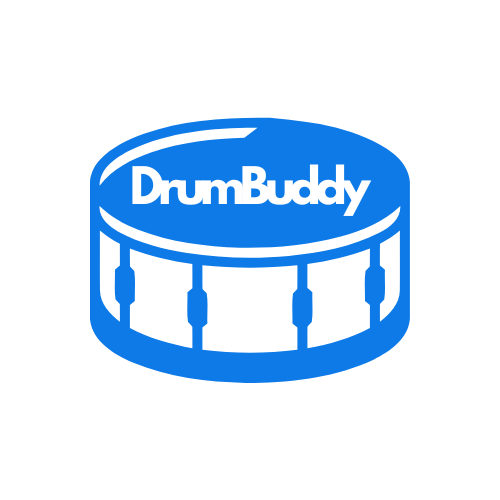

<!-- PROJECT LOGO -->
<br />
<div align="center">
  <a href="https://github.com/baluka1118/DrumBuddy">
    
  </a>

  <p align="center">
    A cross-platform app for drummers to record, learn, and improve their rhythm.
    <br />
    <strong>Bachelor's Thesis Project by Szabó Balázs</strong>
    <br />
    <br />
    <a href="https://github.com/baluka1118/DrumBuddy/issues/new?labels=bug&template=bug_report.md">Report Bug</a>
    &middot;
    <a href="https://github.com/baluka1118/DrumBuddy/issues/new?labels=enhancement&template=feature-request.md">Request Feature</a>
  </p>
</div>


---

<!-- TABLE OF CONTENTS -->
<details>
  <summary>Table of Contents</summary>
  <ol>
    <li>
      <a href="#about-the-project">About The Project</a>
      <ul>
        <li><a href="#built-with">Built With</a></li>
      </ul>
    </li>
    <li>
      <a href="#getting-started">Getting Started</a>
      <ul>
        <li><a href="#installation">Installation</a></li>
      </ul>
    </li>
    <li><a href="#usage">Usage</a></li>
    <li><a href="#roadmap">Roadmap</a></li>
    <li><a href="#contact">Contact</a></li>
    <li><a href="#acknowledgments">Acknowledgments</a></li>
  </ol>
</details>


---

## About The Project

**DrumBuddy** is a cross-platform desktop application built for drummers who want to record, analyze, and improve their rhythm.  
It allows users to record their beats onto a **digital sheet**, get **real-time feedback**, and **store their ideas** for future practice or composition.

One of DrumBuddy’s core features is the ability to **compare two sheets**:
- Use one as a _base sheet_ (your intended rhythm)
- Use another as your _played performance_  
→ The app then provides feedback, helping drummers identify mistakes and improve their timing.

It’s designed to work with **any electronic drum kit**, with **customizable MIDI mappings** for flexible compatibility.

> 🎓 This application also serves as my **Bachelor’s thesis project**

---

### Built With

DrumBuddy is 100% C#, leveraging modern cross-platform and reactive technologies:

* [AvaloniaUI](https://avaloniaui.net/) — for building the cross-platform UI  
* [ReactiveUI](https://reactiveui.net/) & [System.Reactive](https://github.com/dotnet/reactive) — for declarative, reactive programming  
* [SQLite](https://www.sqlite.org/) — lightweight embedded database for sheet persistence  
* [ManagedBass](https://github.com/ManagedBass/ManagedBass) — audio & MIDI library for handling drum input, and metronome audio playback  

---

## Getting Started

### Installation

#### 🪟 Windows
1. Download the latest `DrumBuddy-win-x64.zip` from [Releases](https://github.com/baluka1118/DrumBuddy/releases)
2. Unzip the archive
3. Launch `DrumBuddy.Desktop.exe`
   - Windows Defender may block it — click **“More Info → Run Anyway”**

#### 🐧 Linux
1. Download the latest `DrumBuddy-linux-x64.zip` from [Releases](https://github.com/baluka1118/DrumBuddy/releases)
2. Unzip it
3. Navigate into the unzipped folder, and make the executable runnable:
   ```bash
   cd linux-x64
   chmod +x DrumBuddy.Desktop
4. Now you can run the app via terminal or file manager

#### 🍎 macOS 
For the time being, due to a lack of a paid developer certificate, you can only run DrumBuddy on macOS by manually signing it yourself.
##### Silicon 
1. Download the latest `DrumBuddy-osx-arm64.zip` from [Releases](https://github.com/baluka1118/DrumBuddy/releases)
2. Extract the zip archive
3. Open the terminal, and navigate to the folder you have extracted the zip to (parent folder of `osx-arm64`)
4. Execute the following commands:
   ```bash
   sudo xattr -cr osx-arm64
   sudo xattr -rd com.apple.quarantine osx-arm64
5. After that navigate into the `osx-arm64` folder, sign the app, and make it executable
   ```bash
   cd osx-arm64
   sudo codesign --force --deep --sign - DrumBuddy.Desktop
   chmod +x DrumBuddy.Desktop
6. Now you can run the app
   ./DrumBuddy.Desktop
##### Intel
1. Download the latest `DrumBuddy-osx-x64.zip` from [Releases](https://github.com/baluka1118/DrumBuddy/releases)
2. Extract the zip archive
3. Open the terminal, and navigate to the folder you have extracted the zip to (parent folder of `osx-x64`)
4. Execute the following commands:
   ```bash
   sudo xattr -cr osx-x64
   sudo xattr -rd com.apple.quarantine osx-x64
5. After that navigate into the `osx-x64` folder, sign the app, and make it executable
   ```bash
   cd osx-x64
   sudo codesign --force --deep --sign - DrumBuddy.Desktop
   chmod +x DrumBuddy.Desktop
6. Now you can run the app
   ./DrumBuddy.Desktop

## Usage
After installation:
- Connect, and select your electronic drum kit (or try out the app via keyboard input)
- Configure your MIDI mappings in the Configuration section
- Create new sheets either by recording your beats, or creating them manually
- Compare sheets to see the difference

## Roadmap
- [ ] Multiple time signatures, and note division (1/32, triplets, sextuplets)
- [ ] MusicXML export
- [ ] User management, and cloud sync

Any feature requests, and feedback is welcome and appreciated. (https://github.com/sz-balage/DrumBuddy/issues)

## Contact
Szabó Balázs, szabobazsi11182@gmail.com

## Acknowledgements
* [AvaloniaUI Community](https://github.com/AvaloniaUI)
* [ReactiveUI Team](https://github.com/reactiveui)
* [ManagedBass](https://github.com/ManagedBass/ManagedBass)
* [JetBrains Rider](https://www.jetbrains.com/rider/)

<p align="right">(<a href="#readme-top">back to top</a>)</p>
